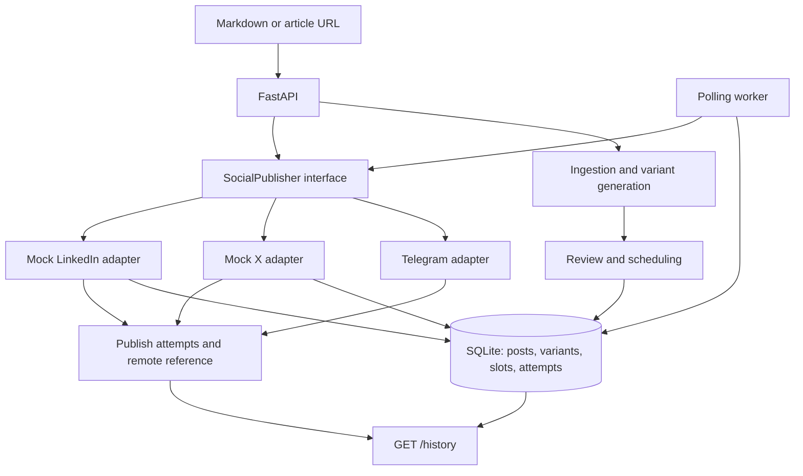

# Social Media Studio

Social Media Studio stores a blog post, generates platform-specific drafts, lets a person review them, and publishes approved variants through adapters. SQLite holds posts, variants, scheduled slots, mock posts, and every publish attempt.

## Requirements

- Python 3.14 or newer
- Dependencies from `requirements.txt`
- A Telegram bot and a channel or chat where the bot is allowed to post

## Setup and run

```bash
python3.14 -m venv .venv
. .venv/bin/activate
python -m pip install -r requirements.txt
cp -n .env.example .env
```

Edit `.env` as needed. Leave `SOCIAL_PUBLISHER` blank to use the variant's platform, or set it to `telegram`, `mock_x`, or `mock_linkedin`. For Telegram, set the bot token and chat ID. Keep `.env` private.

Start the API from the project root:

```bash
PYTHONPATH=src .venv/bin/uvicorn main:app --reload
```

Seed one sample campaign (run once; it schedules a mock X post two minutes ahead):

```bash
PYTHONPATH=src .venv/bin/python -m seed
```

Start the durable scheduler in another terminal:

```bash
PYTHONPATH=src .venv/bin/python -m worker
```

The worker checks SQLite for due slots every five seconds. To process one batch and exit, run `PYTHONPATH=src .venv/bin/python -m worker --once`.

## Create and publish a campaign

1. Create a post with `POST /posts`, providing either `markdown` or a public `url`.
2. Generate its Telegram, mock X, and mock LinkedIn variants with `POST /posts/{post_id}/variants`.
3. Review each result. Approve it with `POST /variants/{variant_id}/approve` or edit/reject it.
4. Schedule an approved variant with `POST /variants/{variant_id}/schedule`. The schedule time must include a timezone and be in the future.
5. The worker publishes it when due. `GET /history` shows attempt result, adapter, preview, and remote reference. `POST /slots/{slot_id}/publish` is also available for a due slot.

With `SOCIAL_PUBLISHER` blank (recommended) or set to `telegram`, approve and schedule the Telegram variant to check the live flow. The worker should publish it around its scheduled time, and `/history` should show the Telegram message reference.

## API reference

All request and response bodies use JSON. Path values such as `{post_id}` are integer IDs returned by earlier requests.

| Method and path                        | What it does                                                                                                                                                                                  |
| -------------------------------------- | --------------------------------------------------------------------------------------------------------------------------------------------------------------------------------------------- |
| `GET /health`                          | Returns the API health status.                                                                                                                                                                |
| `GET /profiles`                        | Lists platform rules for length, hashtags, blocked phrases, and required tone words.                                                                                                          |
| `POST /posts`                          | Stores pasted Markdown or fetches and stores a public HTTP(S) article URL. Provide exactly one of `markdown` or `url`.                                                                        |
| `GET /posts/{post_id}`                 | Returns a stored source post.                                                                                                                                                                 |
| `POST /posts/{post_id}/variants`       | Generates and stores Telegram, mock X, and mock LinkedIn drafts from the stored post.                                                                                                         |
| `GET /posts/{post_id}/variants`        | Lists variants generated for a post.                                                                                                                                                          |
| `GET /variants/{variant_id}`           | Returns one variant and its review status.                                                                                                                                                    |
| `PATCH /variants/{variant_id}`         | Updates variant text after constraint validation. An edited variant returns to `draft`.                                                                                                       |
| `POST /variants/{variant_id}/approve`  | Approves a valid draft for scheduling.                                                                                                                                                        |
| `POST /variants/{variant_id}/reject`   | Rejects a variant.                                                                                                                                                                            |
| `POST /variants/{variant_id}/schedule` | Schedules an approved variant for a future, timezone-aware time. Returns the new slot.                                                                                                        |
| `POST /slots/{slot_id}/publish`        | Publishes a due slot now. Repeated calls return the saved result without publishing again.                                                                                                    |
| `GET /history?limit=100`               | Lists publish attempts, newest first. `limit` can be from 1 to 500.                                                                                                                           |
| `POST /slots/{slot_id}/resolve`        | Resolves an uncertain delivery after a person checks the target. Send `{"delivered": true, "remote_reference": "chat-id:message-id"}` if it arrived, or `{"delivered": false}` if it did not. |
| `POST /variants/validate`              | Checks text against a platform profile without storing it. Provide `platform` and `text`.                                                                                                     |

Scheduling requires an approved variant. Validation or review conflicts return a 4xx response with a detail explaining the rejection; publishing errors return 409 or 502 depending on whether delivery is uncertain or rejected.

## Interactive API docs

With the API running, open [http://localhost:8000/docs](http://localhost:8000/docs) to use FastAPI's Swagger UI. Expand an endpoint, choose **Try it out**, fill in any path values and JSON request body, then select **Execute** to send the request and inspect its status code and response. For example, create a post first, then use its returned ID in the path for generating variants. Approve a variant before scheduling it; schedule times must be in the future and include a timezone.

## Tests

```bash
PYTHONPATH=src .venv/bin/python -m unittest discover -s tests -v
```

## Architecture



The worker uses durable SQLite slots and records every attempt. Mock publishes are reconciled after a crash using their unique local post record.

> [!NOTE]
> Telegram does not support idempotency keys. If a worker stops during a send and cannot confirm whether Telegram accepted it, the attempt becomes `unknown` and is held for review instead of being sent again automatically. Check the Telegram target, then resolve the attempt with `POST /slots/{slot_id}/resolve`: send `{"delivered": true, "remote_reference": "chat-id:message-id"}` if it arrived, or `{"delivered": false}` if it did not. A confirmed undelivered slot becomes failed and can be retried manually.
